<p align="center">
  
</p>

<p align="center">
  <h1>🦍 KONG WALLET – Secure Crypto Wallet euyyyy</h1>
</p>


</div>

---

<div align="center">

**KONG Wallet** adalah simulasi dompet kripto berbasis web yang dirancang untuk menampilkan bagaimana dompet digital modern bekerja dengan antarmuka yang elegan, fitur aman, dan struktur siap dikembangkan ke blockchain nyata.

> ⚠️ *Catatan: Ini adalah aplikasi simulasi. Tidak terhubung ke blockchain nyata.*

---

## 🌐 Demo Live

👉 [https://kongali1720.github.io/kong-wallet](https://kongali1720.github.io/kong-wallet)


<div style="text-align:center; margin-top: 30px;">
  
  <p style="color: limegreen; font-family: monospace; font-size: 1rem; margin-top: 10px;">
    Powered by <strong>Kong Wallet</strong>
  </p>
</div>

</div>

---

## 📱 Fitur Utama

- 🔐 **Login dengan PIN Aman**
- 💰 **Generate Simulasi Wallet (BTC & ETH)**
- 💸 **Kirim & Terima Transaksi Palsu**
- 🧾 **Riwayat Transaksi**
- 📦 **Backup Wallet (Mnemonic 12 Kata)**
- 🎨 **Tampilan UI Futuristik & Responsif**
- 🔄 **Data tersimpan di localStorage browser**

---

## 📁 Struktur Utama KONG WALLET

```mermaid
graph TD
    A[kong-wallet]

    A --> B[📱 MOBILE APP]
    A --> C[🌐 WEB VERSION]
    A --> D[🖥️ BACKEND/API]
    A --> E[📦 DEPLOYMENT & DOCUMENTATION]
```



## 🧠 Struktur Folder KONG WALLET Lengkap

```mermaid
graph TD
    A[kong-wallet]

    %% Level 1
    A --> B[📱 MOBILE APP]
    A --> C[🌐 WEB VERSION]
    A --> D[🖥️ BACKEND/API]
    A --> E[📦 DEPLOYMENT & DOCS]

    %% MOBILE APP
    B --> B1[www/]
    B1 --> B1a[index.html]
    B1 --> B1b[assets/]
    B1b --> B1b1[icons/]
    B1b --> B1b2[images/]
    B1b --> B1b3[fonts/]
    B1 --> B1c[css/]
    B1 --> B1d[js/]
    B --> B2[platforms/]
    B2 --> B2a[android/]
    B2 --> B2b[ios/]
    B --> B3[plugins/]
    B --> B4[config.xml]

    %% WEB VERSION
    C --> C1[public/]
    C --> C2[src/]
    C2 --> C2a[components/]
    C2 --> C2b[pages/]
    C2 --> C2c[utils/]
    C2 --> C2d[styles/]
    C --> C3[build/]
    C --> C4[webpack.config.js]

    %% BACKEND/API
    D --> D1[src/]
    D1 --> D1a[controllers/]
    D1 --> D1b[models/]
    D1 --> D1c[routes/]
    D1 --> D1d[middleware/]
    D1 --> D1e[utils/]
    D1 --> D1f[config/]
    D --> D2[Dockerfile]
    D --> D3[.env]

    %% DEPLOYMENT & DOCS
    E --> E1[docker/]
    E --> E2[kubernetes/]
    E --> E3[scripts/]
    E --> E4[ci-cd/]
    E --> E5[docs/]
    E --> E6[designs/]
    E --> E7[legal/]
    E --> E8[tests/]
```




## 🎯 Tujuan Proyek

KONG Wallet dibangun sebagai:
- Prototipe edukasi dompet digital
- Fondasi pengembangan dompet asli (real blockchain)
- Simulasi pitch untuk calon investor / pengguna
- Latihan pengembangan Android TWA (Trusted Web Activity)

---

## ⚙️ Struktur Folder

```bash
.
├── index.html         # Halaman utama wallet
├── login.html         # Halaman login
├── style.css          # Gaya visual
├── app.js             # Logika utama wallet
├── login.js           # Login PIN handler
├── mnemonic.js        # Generator mnemonic seed
└── README.md
```
---

<div align="center">
  
## ❤️ Special Thanks

Made with 🔥 by KONGALI1720 Cyber Force.  

“Scan like a ghost, strike like a hammer.” 

</div>

---

<div align="center">
  
## ✅ Gaspol coding squad Indonesia! 🚀💻

 Halo, Sobat Koding!  
 Hey, Coding Friends!

 Kumpulan mini project Python yang gak bikin ngantuk!  
 Collection of Python mini projects that won’t bore you!

 Belajar sambil praktek langsung, cocok buat yang suka action daripada teori.  
 Learn by doing, perfect for those who prefer action over theory.

Langsung eksekusi, langsung paham.  
Run it directly, understand instantly.

</div>

---


<h3 align="center">💡 ☕ Traktir Kopi & Nasi Padang ama nasi Gorengnya ya cuy! 😄</h3>

<div align="center">

## Dukung terus biar semangat bikin karya edukatif lainnya...  
## Keep supporting so I stay motivated to create more educational works...

# 💡 ☕  [Buy Me a Coffee via PayPal](https://www.paypal.com/paypalme/bungtempong99)  

Support with ☕ so I can buy 🍜 and keep being 🧠!

---

<h2>📫 Let’s Connect Like Hackers</h2>

| Platform | Detail |
|:--------|:-------|
| GitHub  | [kongali1720](https://github.com/kongali1720) |
| Email   | [kongali1720@gmail.com](mailto:kongali1720@gmail.com) |
| Site    | [Coming soon — stay curious... ](https://kongali1720.github.io) |

---

## ❤️  💻 INITIATING HUMANITY MODE... for Down Syndrome ❤️

| Item        | Keterangan / Description |
|:------------|:-------------------------|
| 🎯 Target   | Anak-anak Pejuang Down Syndrome / Kids with Down Syndrome |
| 📡 Status   | Butuh Dukungan / Needs Support |
| 🧠 Response | Buka Hati + Klik Link = Satu Senyum Baru / Open Heart + Click Link = One New Smile |

Mereka bukan berbeda — mereka dilahirkan untuk mengajarkan dunia tentang cinta yang murni dan kesabaran yang luar biasa.  
They are not different — they were born to teach the world pure love and extraordinary patience.

<p align="center" style="font-size: 1.5rem;">
  <a href="https://mydonation4ds.github.io/" target="_blank" style="display: inline-block;">
    
  </a>
</p>

</div>


---

<section align="center" style="font-family: Arial, sans-serif;">

<h2 style="margin-bottom: 20px; color: #0070f3;">💳 Dukungan Pembayaran DONASINYA</h2>

<table align="center" aria-label="Metode Pembayaran" style="margin: 0 auto; border-collapse: collapse; box-shadow: 0 4px 10px rgba(0,0,0,0.1); border-radius: 8px; overflow: hidden;">
  <thead style="background-color: #0070f3; color: white;">
    <tr>
      <th style="padding: 12px 25px; font-size: 18px;">Visa</th>
      <th style="padding: 12px 25px; font-size: 18px;">Mastercard</th>
      <th style="padding: 12px 25px; font-size: 18px;">PayPal</th>
    </tr>
  </thead>
  <tbody style="background-color: #f9f9f9;">
    <tr>
      <td style="padding: 15px;">
        
      </td>
      <td style="padding: 15px;">
        
      </td>
      <td style="padding: 15px;">
        
      </td>
    </tr>
  </tbody>
</table>

</section>


---

<p align="center">
  Kalau project ini bantu kamu, jangan lupa kasih bintang ⭐ dan share ke temen-temen ya!<br>
  Follow <a href="https://twitter.com/kongali1720" target="_blank" rel="noopener noreferrer">@kongali1720</a> buat diskusi dan update seru lainnya 🔥
</p>

<p align="center" style="margin-top: 20px;">
  <a href="https://twitter.com/kongali1720" target="_blank" rel="noopener noreferrer" aria-label="Follow kongali1720 on Twitter">
    
  </a>
</p>

</div>
<div align="center">

---
